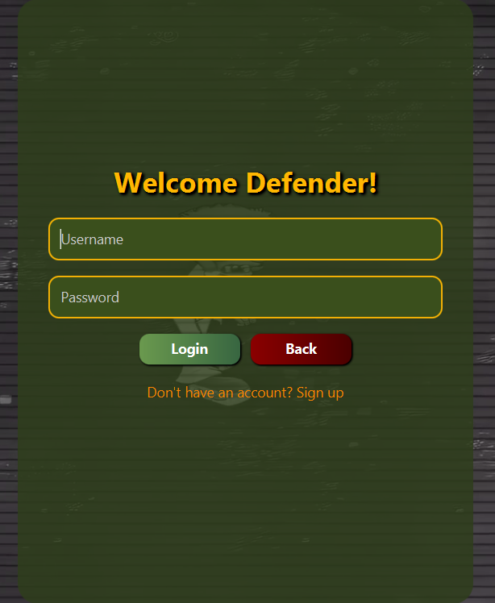
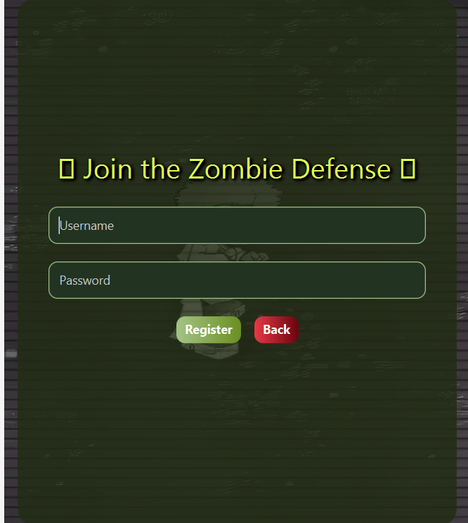
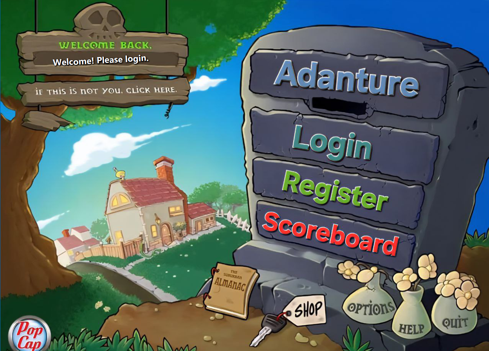
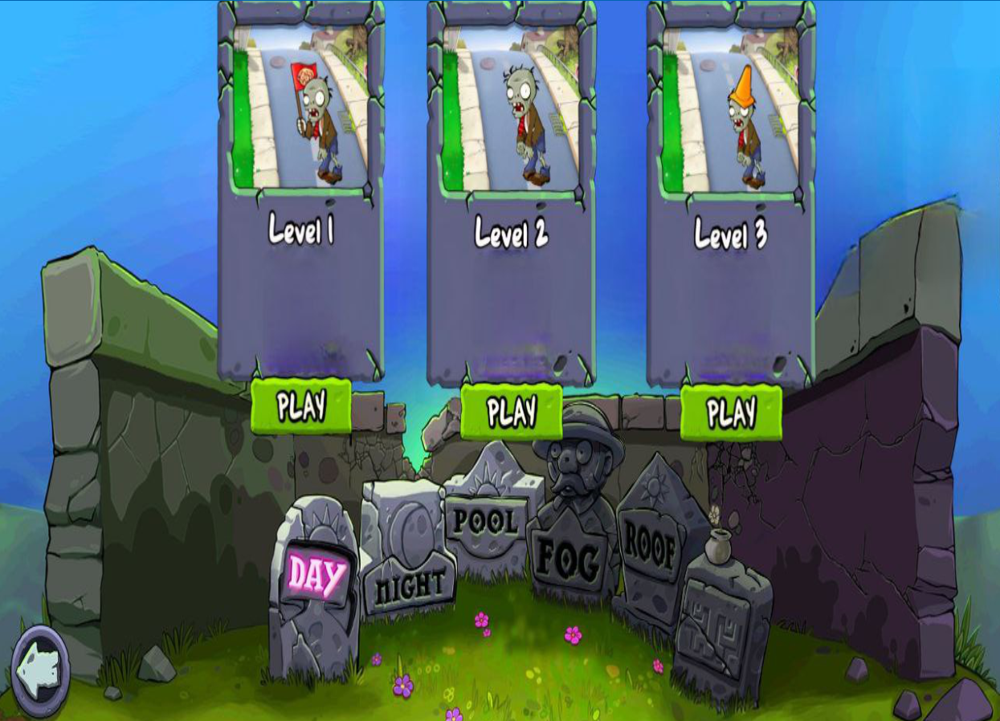
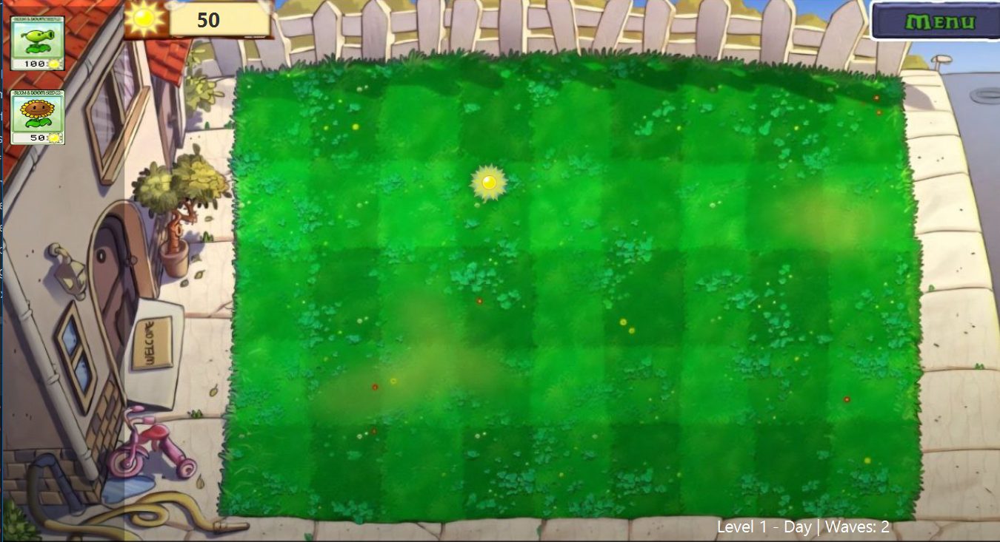
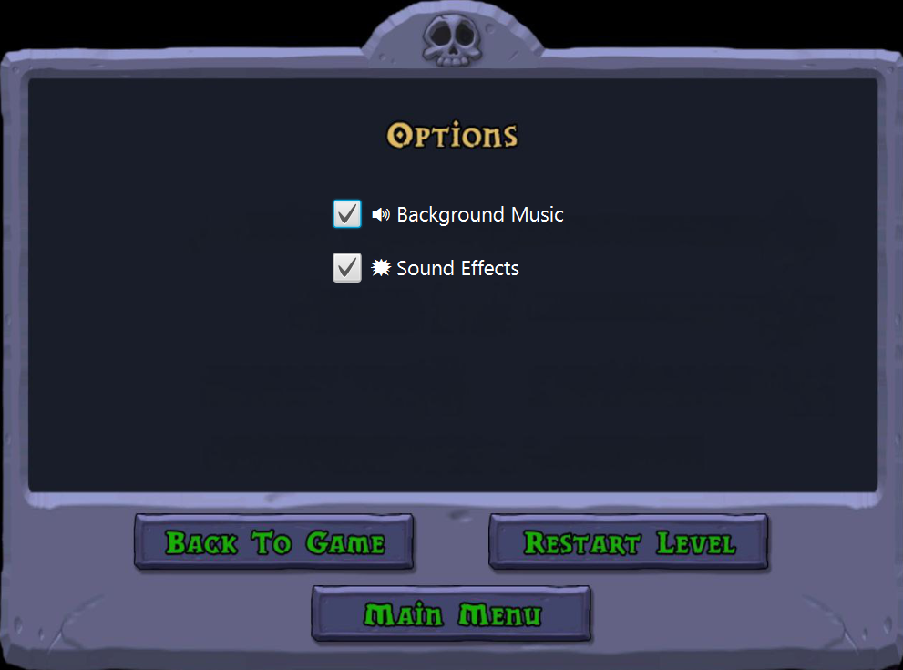
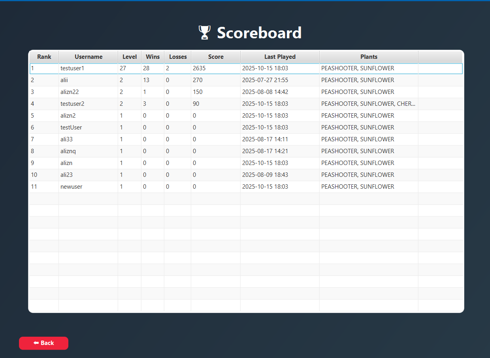
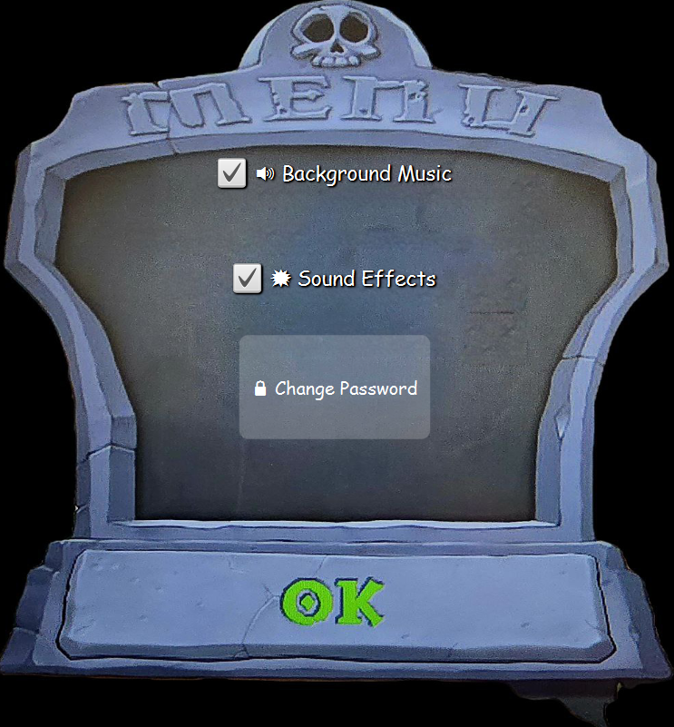

# 🧟‍♂️ Plants vs Zombies — AP Final Project

**Plants vs Zombies (AP Edition)** is a fully functional, JavaFX-based clone of the classic tower-defense game, developed as the **final project** for the *Advanced Programming (AP)* course at the **University of Isfahan** — *Spring 2025*.  

The game follows a clean **Model–View–Controller (MVC)** architecture and applies **SOLID** principles to keep the codebase scalable, modular, and easy to expand with new plants, zombies, and levels.

---

## 🚀 Key Features
- 🎮 **Playable JavaFX game** with smooth animations, real-time actions, and sounds  
- 🌻 **Plant types:** shooters, sun producers, defenders, and special ability plants  
- 🧟 **Zombie types:** walking, shielded, newspaper, and other unique behaviors  
- ☀️ **Sunlight resource system** — collect and spend to plant units  
- 🧠 **Collision system** for interactions between bullets and zombies  
- 💾 **Persistent data storage** using **SQL (phpMyAdmin)**  
- ⚙️ **Custom exception handling** and in-game event management  
- 🧩 **Extensible structure:** easily add new plants, zombies, levels, or game logic  
- 🎵 **Dynamic sound & GIF management** via the `util` package  
- 🧰 **Thread-based mechanics** for game loops, sun production, and zombie movement  

---

## 🧩 Tech Stack
| Layer | Technology |
|-------|-------------|
| 🖥️ UI | JavaFX, FXML |
| 🧠 Logic | Java (MVC pattern, SOLID principles) |
| 💾 Database | SQL (via phpMyAdmin, MySQL) |
| ⚙️ Build Tool | Maven |
| 🧰 IDE | IntelliJ IDEA |
| 🎵 Media | Custom assets in `/resources/media` |

---

## 📂 Project Structure
src/

├── main/

│ ├── java/

│ │ ├── controller/ # JavaFX controllers (FXML handlers)

│ │ ├── model/

│ │ │ ├── board/ # Game board, cells, coordinates

│ │ │ ├── plants/ # All plant types (Shooter, SunShroom, CherryBomb, etc.)

│ │ │ ├── zombies/ # All zombie types (Normal, ScreenDoor, Newspaper, etc.)

│ │ │ ├── items/ # Bullets, suns, and collectible items

│ │ │ ├── collision/ # Collision handler logic

│ │ │ ├── enums/ # Game states, plant/zombie types
ر│
│ │ │ └── GameModel.java # Core model class

│ │ ├── service/ # GameService, PlantService, etc. (manages logic and state)

│ │ ├── util/ # DBConnection, SoundManager, GifManager, Constants

│ │ ├── exceptions/ # Custom exception classes

│ │ └── Main.java # Launcher class

│ └── resources/

│ ├── fxmls/ # UI layout files (Login, MainMenu, Levels, GameBoard, etc.)

│ ├── media/ # Videos, sounds, and GIF assets

└── src/screenshots/ # Project screenshots and demo video

---

## 🧠 Architecture Overview
This project uses **MVC (Model–View–Controller)** separation:

- **Model:** Core game logic — plants, zombies, collisions, database, and rules  
- **View:** JavaFX FXML layouts, styled to match the original PvZ theme  
- **Controller:** Handles UI interactions and bridges the view with the model  

Additional layers:
- `service/` for higher-level orchestration  
- `util/` for sound, GIFs, and database management  
- `exceptions/` for controlled runtime errors  

---

## ⚙️ Database
The project uses **MySQL** through **phpMyAdmin**.  
A `DBConnection` singleton class manages the connection.

Example default configuration:
- String url = "jdbc:mysql://localhost:3306/plants_vs_zombies";
- String user = "root";
- String password = "";

Database tables store:

- Player info (username, stats)
- Game scores
- Settings / progress

---

## 🖼️ Screenshots

  
  
  

  
  
  

  
  

🎥 Gameplay Demo:
A short demo video (gameview.mp4, 50 MB) is available inside
src/screenshots

---

## ▶️ How to Run

Clone the repository:

git clone https://github.com/alizn7/PlantsVsZombies-AP.git

cd PlantsVsZombies-AP

1.Open in IntelliJ IDEA

2.Ensure JavaFX SDK(21 recommended) and MySQL server are properly configured (you can use XAMPP control panel)

3.Run the Main class (JavaFX Application)

---

## 🧩 Extensibility

This project was built with scalability in mind:
Add new Plant or Zombie classes easily by extending base abstract types
Game loop logic automatically integrates new units
New levels can be defined via LevelConfig classes or FXMLs
Modular design follows SOLID and OOP best practices

---

## 🎓 Academic Context

- 📘 Developed as the final project for the Advanced Programming (AP) course
- 🏫 Department of Computer Engineering, University of Isfahan — Spring 2025
- 👨‍💻 Individual coursework with full JavaFX implementation

---

## 💬 Author

- Ali Zandian
- 🎓 Computer Engineering Student — University of Isfahan
- 📫 GitHub: @alizn7

---

## 🪴 License

This project is open for educational and non-commercial use.

